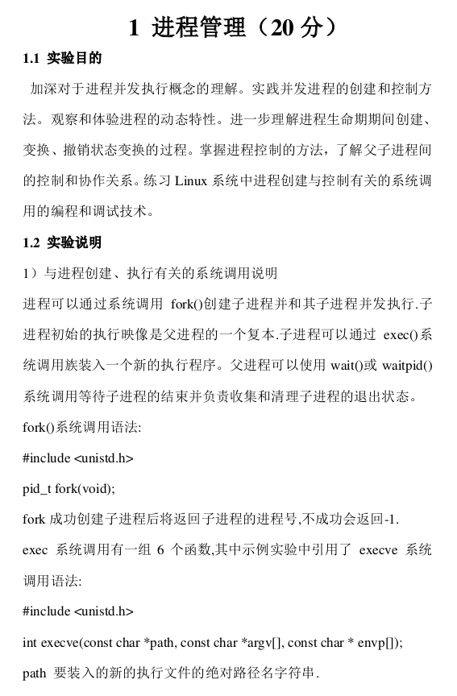
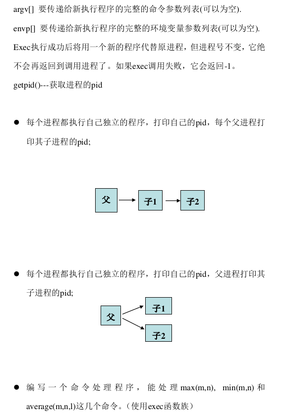
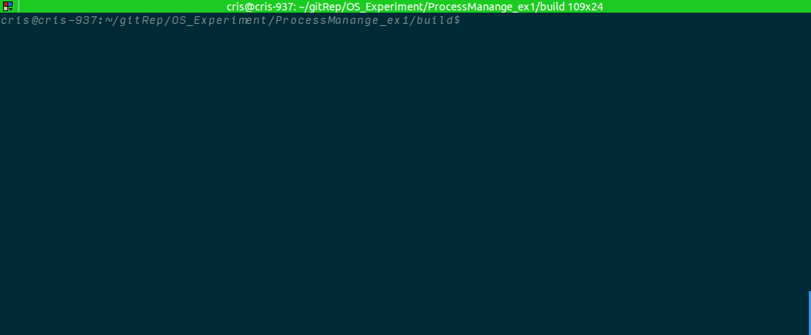
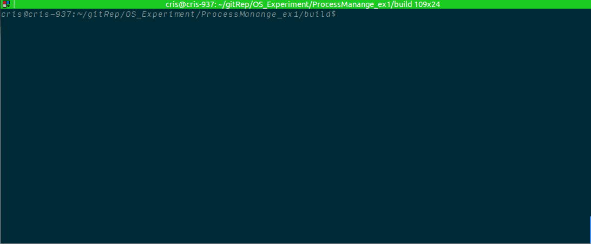
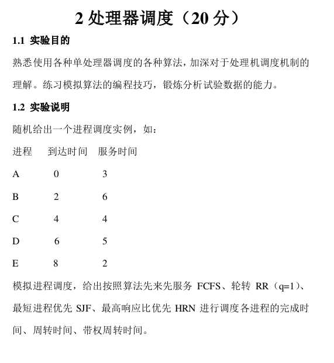
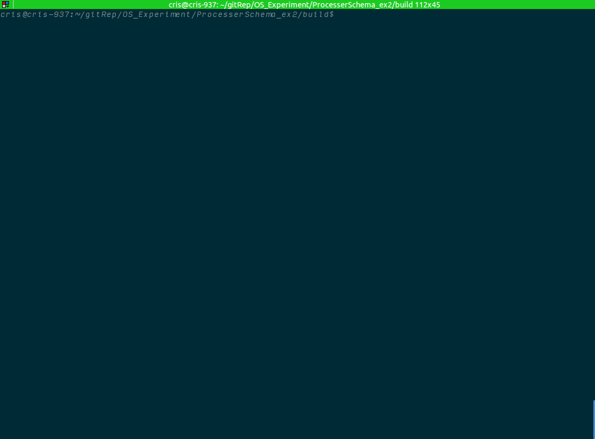
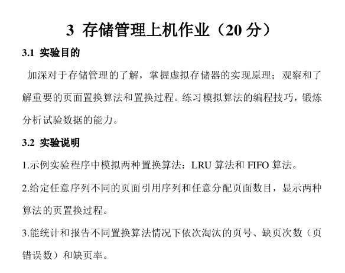

# OS_Experiment
some experiments of operation system course

## Environment:
  1. x86-64
  2. linux 4.4.0
  3. g++ 5.0 (or any other version supporting C++11)
  4. cmake >= 2.8
  5. Matlab >= R2014b

## Steps for Using
```
mkdir -p build
cd build
cmake ..
make
```

## Command Format:
```
[command] [input file] [algorithm name]
```

## Ex1 Process Manage
 

I implemment this experiment with C++ in Linux, the result is:



## Ex2 Processer Schema

I implemment this experiment with C++ in Linux, the result is shown in follow. Note that, the given process list could be modified in the file processList.txt.


## Ex3 Storage Manage



